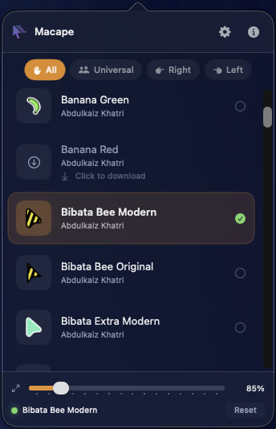
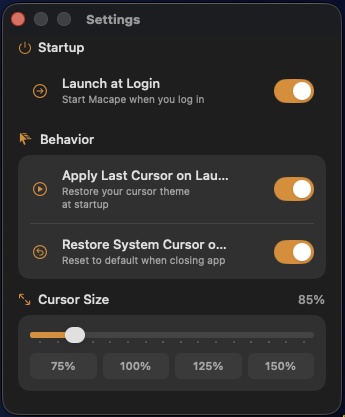
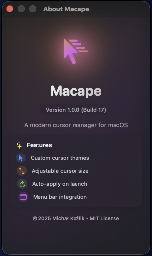

  

<h1 align="center">Macape</h1>

  <strong>Custom Cursor Themes for macOS</strong>

  
  

  
  
  
  

---

A modern, lightweight cursor manager that lets you apply custom XCursor themes system-wide on macOS Sequoia and later. Replace your boring default cursor with beautiful themes from the Linux community.

---

## Features

### 40+ Cursor Themes
Choose from over 40 professionally designed cursor themes including Bibata, BreezeX, Google Dot, Nordzy, Phinger, and more.

### One-Click Apply
Select a theme and it's instantly active system-wide. No restart required, no complex setup.

### Cursor Scaling
Adjust cursor size from 75% to 150% with a smooth slider. Perfect for high-DPI displays or accessibility needs.

### Menu Bar App
Quick access from the menu bar. Browse, download, and apply themes without leaving your workflow.

### Filter by Handedness
Find themes designed for left-handed, right-handed, or universal use.

### Smart Cursor Detection
Automatically switches between arrow, text cursor, pointer, and resize cursors based on context.

### Privacy First
No data collection, no analytics, no internet required after initial theme downloads.

---

## Screenshots

  
  
  

---

## Available Themes

| Category | Themes |
|----------|--------|
| **Bibata** | Modern, Original, Classic, Ice, Amber (12 variants) |
| **BreezeX** | Default, Black, Dark, Light |
| **Google Dot** | Black, White, Blue, Red |
| **Fuchsia** | Default, Amber, Pop, Red |
| **Banana** | Default, Blue, Green, Red |
| **Nordzy** | Default, White, Left-handed variants |
| **Phinger** | Light, Dark, Left-handed variants |
| **XCursor Pro** | Dark, Light, Red |
| **macOS Style** | Default, White |
| **And more...** | 40+ themes total |

---

## Requirements

- macOS 15.0 (Sequoia) or later
- Apple Silicon or Intel processor
- Accessibility permissions (for system-wide cursor)

---

## Installation

1. Download the latest DMG from [Releases](https://github.com/7MichalKozlik7/Macape/releases)
2. Open the DMG and drag Macape to Applications
3. Launch Macape from Applications
4. Grant Accessibility permissions when prompted

---

## How It Works

Macape uses an overlay window technique to display custom cursors system-wide:

1. Parses XCursor theme files into native macOS images
2. Creates a transparent overlay window that follows the mouse
3. Hides the system cursor using CoreGraphics
4. Detects cursor type changes and updates the overlay accordingly

This approach works on macOS 15+ where traditional cursor modification methods no longer function.

---

## Legal

- [Privacy Policy](https://github.com/7MichalKozlik7/Macape/blob/main/privacy.md)
- [Terms of Service](https://github.com/7MichalKozlik7/Macape/blob/main/terms.md)
- [EULA](https://github.com/7MichalKozlik7/Macape/blob/main/eula.md)
---

  <strong>Your cursor. Your style.</strong>

  &copy; 2025 Michał Koźlik. All rights reserved.

